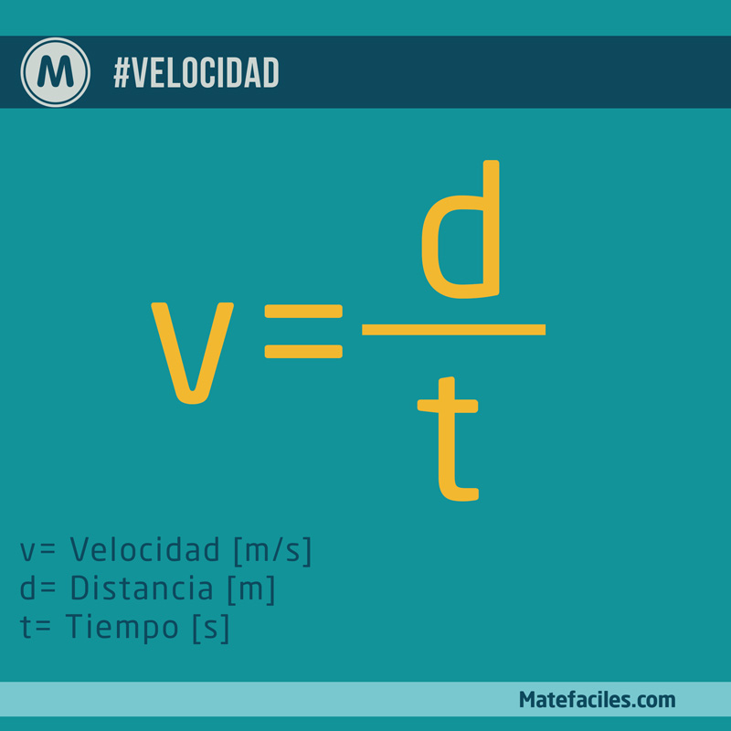
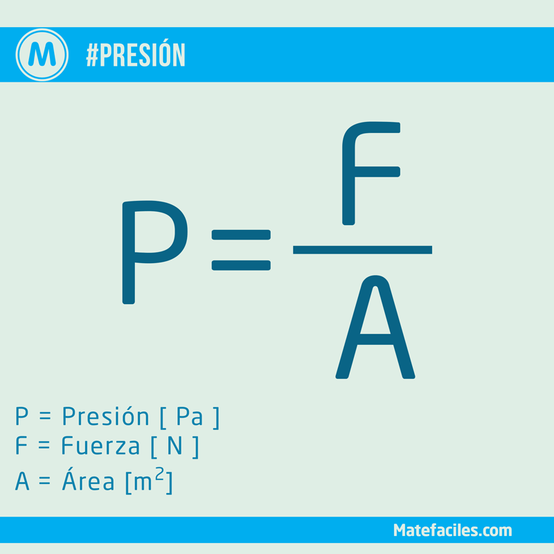
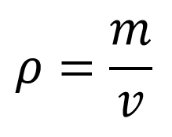

<h1 style="color:Red;">Calculadora</h1>  

___

<h1>Introduccion</h1>  

El objetivo de este proyecto es dar a conocer nuestro trabajo echo en pareja el cual es una calculadora echa en Android estudio en cual tiene como finalidad calcular operaciones de Fisica en las cuales podemos calcular la posicion final , la distancia , la presion y la densidad.

  

___

<h1>Objetivo General</h1>  

Nuestra app se creo para calcular diversas formulas de fisica en la cual el usuario ingresara los datos que la calculadora le solicitara y al finalizar por medio de un boton de calcular realizara toda la operacion y dara el resultado.

___

<h1>Obejtivos Especificos</h1>  

Nuestra app sirve para realizar formulas como :
- Posicion Final: S = S0 + V*T 
- Distancia : d = V*T
- Presion : F / A
- Densidad = M / V

___

<h1>Descripcion Sobre el Software</h1>  

- La app calculadora ayuda al usuario a realizar calulos sobre la presion y densidad  
- La app se creo para facilitar el calculo de diversas formulas de fisica , haciendo facil el uso de la misma.
- La app hace facil la interactividad con el usuario y tambien hace facil el uso del mismo. 

  
  

  
  

 

- "Calculadora" ayuda a realizar la formula () de la posicion final donde "So" es posicion inicial , donde "V" es velocidad y "T" es tiempo.
___

<h1>Recursos Utilizados</h1>  

Los recursos a utilizar son lo siguientes :

### Recursos Android
- Botones 
- Barras de Texto
- Emulador
### Software
- windows : Windos 10
- Andorid Koala 2024
- Android "Oreo"; Android 8.0
- API 26
- Lenguaje Kotlin
___

<h1>Requisitos Minimos</h1>  

- Android "Oreo"; Android 8.0 ó posteriores
- 1 GB Ram.
- Resulocion de pantalla :  HD+ (720×1280 píxeles) como minimo .
- Procesador ARM o Equivalente.
- Sistema Operativo Android "Oreo"; Android 8.0 (como minimo). 
___

<h1>Flujo del Software</h1>  

"Calculadora" calcula formulas especificas de fisica , en el cual el usuario ingresara los datos que se le estara pidiendo , en el caso de la formula de posicion final , el usuario tendra que ingresar la posicion final "So" , seguido de eso tendra que ingresar la velocidad y por ultimo el tiempo , habra un boton que "Calcular" el cual hara toda la operacion para finalmente dar la respuesta. 
"Calculadora" tendra diferentes formulas en los cuales el funcionamiento es similar , lo que cambiaria solo serian los datos.
___

<h1>Integrantes</h1>  

5to Computacion
Seccion "A"
"Proyecto Final" 

- Can Xicay Angel David
- Concoha Suybuyuj Carlos Emilio 